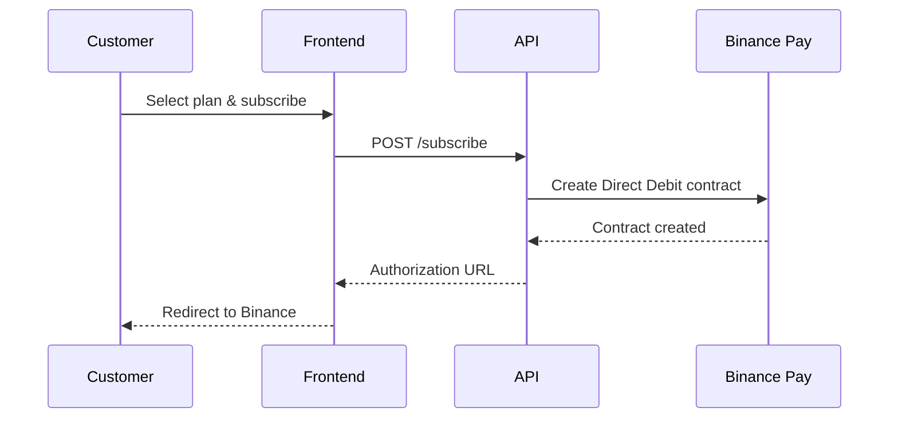
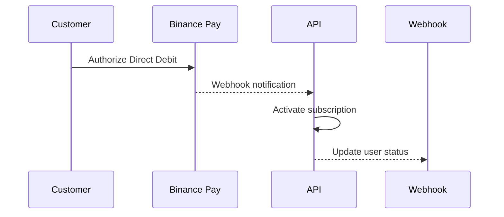
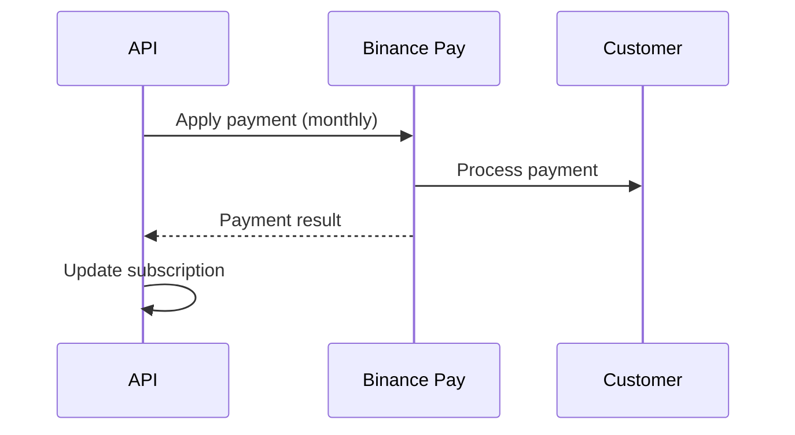

# Binance Pay Integration Setup Guide

This guide will help you set up Binance Pay Direct Debit for subscription payments in your Winu trading bot.

## 🚀 Quick Start

### 1. Register as Binance Pay Merchant

1. **Visit**: [merchant.binance.com](https://merchant.binance.com)
2. **Create Account**: Complete KYC/KYB verification
3. **Apply for Direct Debit**: Submit request for Direct Debit functionality
4. **Get Approved**: Wait for Binance approval (can take several days)

### 2. Get Your Credentials

After approval, you'll receive:
- **API Key**: Your merchant API key
- **Secret Key**: Your merchant secret key  
- **Merchant ID**: Your unique merchant identifier
- **Webhook Secret**: For webhook verification

### 3. Configure Environment Variables

Update your `production.env` file:

```bash
# Binance Pay Configuration
BINANCE_PAY_API_KEY=your_actual_api_key_here
BINANCE_PAY_SECRET_KEY=your_actual_secret_key_here
BINANCE_PAY_MERCHANT_ID=your_actual_merchant_id_here
BINANCE_PAY_WEBHOOK_SECRET=your_actual_webhook_secret_here
```

### 4. Restart Services

```bash
docker restart winu-bot-signal-api
```

## 📋 Subscription Plans

Your system includes three subscription tiers:

| Plan | Price | Features | Max Positions | Min Signal Score |
|------|-------|----------|---------------|------------------|
| **Basic** | 29.99 USDT/month | Basic signals, Email alerts, Web dashboard | 3 | 70% |
| **Pro** | 59.99 USDT/month | All signals, Telegram alerts, Priority support, Advanced analytics | 5 | 65% |
| **Premium** | 99.99 USDT/month | All signals, All alerts, 24/7 support, Custom strategies, API access | 10 | 60% |

## 🔧 API Endpoints

### Frontend Integration

**Base URL**: `https://api.winu.app/api/binance-pay`

#### Available Endpoints:

1. **GET /plans** - Get subscription plans
2. **POST /subscribe** - Create subscription
3. **GET /contract/{contract_id}/status** - Check contract status
4. **POST /contract/{contract_id}/authorize** - Authorize contract
5. **POST /contract/{contract_id}/cancel** - Cancel subscription
6. **POST /webhook** - Handle webhook notifications
7. **GET /payment-history** - Get payment history
8. **POST /test-payment** - Test integration

### Example Usage:

```javascript
// Create subscription
const response = await fetch('/api/binance-pay/subscribe', {
  method: 'POST',
  headers: {
    'Content-Type': 'application/json',
    'Authorization': 'Bearer your_jwt_token'
  },
  body: JSON.stringify({ plan_id: 'pro' })
});

const data = await response.json();
console.log(data.authorization_url); // Redirect user to this URL
```

## 🔄 Payment Flow

### 1. Customer Subscribes


### 2. Customer Authorizes


### 3. Monthly Billing


## 🛡️ Security Features

### Webhook Verification
```python
def verify_webhook_signature(payload, signature, secret):
    expected_signature = hmac.new(
        secret.encode('utf-8'),
        payload.encode('utf-8'),
        hashlib.sha256
    ).hexdigest()
    return hmac.compare_digest(signature, expected_signature)
```

### Rate Limiting
- API calls are rate limited to prevent abuse
- Webhook endpoints have additional protection

## 📊 Monitoring & Analytics

### Key Metrics to Track:
- **Subscription Conversion Rate**: How many users complete authorization
- **Payment Success Rate**: Percentage of successful monthly payments
- **Churn Rate**: How many users cancel subscriptions
- **Average Revenue Per User (ARPU)**

### Logging:
All Binance Pay interactions are logged for debugging:
```bash
docker logs winu-bot-signal-api | grep "Binance Pay"
```

## 🚨 Troubleshooting

### Common Issues:

1. **"Binance Pay credentials not configured"**
   - Check environment variables are set correctly
   - Restart API service after updating env vars

2. **"Contract creation failed"**
   - Verify merchant account is approved for Direct Debit
   - Check API credentials are valid

3. **"Webhook processing failed"**
   - Ensure webhook URL is accessible: `https://api.winu.app/api/binance-pay/webhook`
   - Verify webhook secret matches

4. **"Authorization timeout"**
   - Contracts expire after 24 hours if not authorized
   - Create new subscription if contract expires

### Testing:

Use the test endpoint to verify integration:
```bash
curl -X POST https://api.winu.app/api/binance-pay/test-payment
```

## 📞 Support

### Binance Pay Support:
- **Documentation**: [Binance Pay Docs](https://developers.binance.com/docs/binance-pay)
- **Support**: [Binance Support](https://www.binance.com/en/support)

### Your System Support:
- Check logs: `docker logs winu-bot-signal-api`
- Monitor webhooks: `docker logs winu-bot-signal-api | grep webhook`
- Test integration: Use the test endpoint

## 🔄 Updates & Maintenance

### Regular Tasks:
1. **Monitor webhook logs** for failed payments
2. **Check contract statuses** for expired authorizations
3. **Update subscription plans** as needed
4. **Review payment success rates**

### Backup Plans:
- Keep Stripe integration as fallback
- Monitor Binance Pay API status
- Have manual payment process for edge cases

## 📈 Revenue Optimization

### Tips for Better Conversion:
1. **Clear Pricing**: Show exact USDT amounts
2. **Feature Comparison**: Highlight plan differences
3. **Easy Authorization**: Streamlined Binance Pay flow
4. **Customer Support**: Help users with authorization issues

### Retention Strategies:
1. **Payment Reminders**: Notify before billing cycles
2. **Failed Payment Recovery**: Automatic retry mechanisms
3. **Customer Success**: Proactive support for issues

---

## 🎉 Success!

Once configured, your customers can:
- ✅ Pay with cryptocurrency (USDT, BTC, BNB, ETH)
- ✅ Set up automatic monthly billing
- ✅ Cancel anytime through their Binance account
- ✅ Enjoy secure, blockchain-based payments

Your Winu trading bot now supports **Binance Pay Direct Debit** for seamless cryptocurrency subscription payments! 🚀


