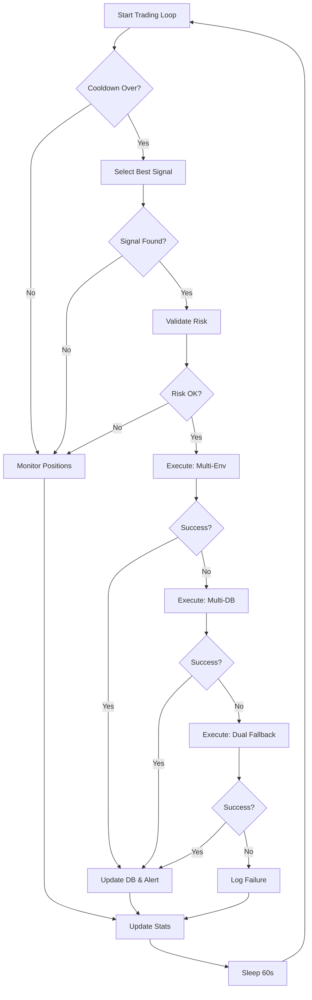

# 🤖 Trading Bot Execution Process Analysis

**Date**: October 14, 2025  
**Status**: ✅ Running (with issues)

---

## 📊 Current Bot Status

### Running Services:
- ✅ **trading-bot** - Up 3 days (port 8003)
- ✅ **trading-bot-api** - Up 4 days (port 8000)
- ✅ **bot-dashboard** - Up 2 days
- ✅ **worker** - Up 4 minutes (Celery)
- ✅ **celery-beat** - Up 4 minutes (Scheduler)

### Current Positions (5 open):
```
📉 DOT/USDT SHORT:  -$0.53 (0.0%)
📈 SOL/USDT SHORT:  +$0.86 (0.0%)
📉 DOGE/USDT LONG:  $0.00 (0.0%)
📉 XRP/USDT LONG:   -$1.45 (0.0%)
📉 BNB/USDT SHORT:  -$3.53 (0.0%)
```

---

## 🔄 Bot Execution Flow

### 1. **Main Loop** (Every 60 seconds)
```
┌─────────────────────────────────────┐
│    TRADING LOOP (60s interval)     │
└─────────────────────────────────────┘
          ↓
┌─────────────────────────────────────┐
│  Should Check for Signals?          │
│  (5-min cooldown between checks)    │
└─────────────────────────────────────┘
          ↓ YES
┌─────────────────────────────────────┐
│    PROCESS TRADING CYCLE            │
└─────────────────────────────────────┘
          ↓
┌─────────────────────────────────────┐
│    MONITOR EXISTING POSITIONS       │
└─────────────────────────────────────┘
          ↓
┌─────────────────────────────────────┐
│    UPDATE STATISTICS                │
└─────────────────────────────────────┘
          ↓
     Wait 60s → Repeat
```

---

## 📈 Trading Cycle Process (Step-by-Step)

### Step 1: Signal Selection
```python
1. Check trading limits
   ├─ Max positions check
   ├─ Daily trade limit
   └─ Risk allocation

2. Get high-quality signals
   ├─ Score >= 0.65 (65%)
   ├─ Created in last 24h
   ├─ Not in existing positions
   └─ Top 10 by score

3. Calculate quality score
   ├─ Base: signal.score (40%)
   ├─ Performance: win rate (30%)
   ├─ Market condition (20%)
   └─ Risk/Reward (10%)

4. Select BEST signal
   └─ Highest quality score
```

**Latest Selection**:
- ✅ Selected: `ETH/USDT LONG`
- ✅ Quality: `1.000` (100%)
- ⚠️ Performance: `0.0%` win rate
- ✅ Market: `bullish trend, 9.6% volatility`

### Step 2: Risk Validation
```python
1. Enhanced validation
   ├─ Balance check
   ├─ Market volatility
   ├─ Correlation check
   └─ Stop loss validation

2. Position sizing
   ├─ Risk per trade: 1-2%
   ├─ Account balance
   └─ Stop loss distance
```

**Latest Validation**: ✅ Passed

### Step 3: Execution (3 Attempts)

#### Attempt 1: Multi-Account (Environment)
```
🚀 Execute on 2 accounts (env-based)
├─ Account 1: ❌ FAILED
│  └─ Error: Order notional < $20
├─ Account 2: ❌ FAILED
│  └─ Error: Order notional < $20
└─ Result: 0/2 successful
```

#### Attempt 2: Multi-Account (Database)
```
🚀 Execute on database accounts
├─ Active accounts: 0
└─ Result: ⚠️ No accounts found
```

#### Attempt 3: Dual Executor (Fallback)
```
🚀 Analyzing signal
├─ Market selection: FUTURES (90% confidence)
└─ Execute futures trade: ❌ FAILED
   └─ Error: Insufficient futures balance
```

**Final Result**: ❌ All 3 execution methods failed

---

## ⚠️ Current Issues Identified

### 🔴 **Critical Issues**

1. **Insufficient Balance**
   ```
   ❌ "Order's notional must be no smaller than $20"
   ❌ "Insufficient futures balance"
   ```
   - Minimum order: $20 USDT
   - Current balance: < $20 USDT
   - **Solution**: Fund trading accounts

2. **No Active Accounts**
   ```
   ⚠️ "Found 0 active trading accounts"
   ```
   - Database has no configured accounts
   - **Solution**: Add trading accounts via API

3. **Symbol Format Mismatch**
   ```
   ❌ "binance does not have market symbol DOTUSDT:USDT"
   ```
   - Bot using: `DOTUSDT:USDT` (ccxt unified)
   - Binance expects: `DOTUSDT` or `DOT/USDT`
   - **Solution**: Fix symbol format conversion

4. **Margin Insufficient**
   ```
   ❌ "Margin is insufficient" (code -2019)
   ```
   - Can't close positions due to insufficient margin
   - **Solution**: Add margin to futures account

---

## 🔧 Bot Configuration

### Test Mode:
```bash
BOT_TEST_MODE=true  # Currently in test mode
```

### Trading Parameters:
```python
cooldown_minutes = 5        # Wait 5 min between signals
min_signal_score = 0.65     # 65% minimum confidence
check_interval = 60         # Check every 60 seconds
```

### Execution Strategy:
1. **Try Environment Accounts** (2 accounts)
2. **Try Database Accounts** (0 configured)
3. **Try Dual Executor** (Fallback)

---

## 📊 Bot Components

### 1. **Signal Selector** (`signal_selector.py`)
- Selects best signal from top 10
- Calculates quality score
- Checks trading limits
- Avoids duplicate positions

### 2. **Risk Manager** (`risk_manager.py`)
- Validates trade safety
- Calculates position size
- Checks volatility
- Manages correlations

### 3. **Dual Executor** (`dual_executor.py`)
- Handles SPOT & FUTURES
- Analyzes best market
- Executes trades
- Monitors positions

### 4. **Multi-Account Manager**
- Environment-based accounts
- Database accounts
- Parallel execution
- Result aggregation

---

## 📈 Statistics

### Session Stats:
```python
signals_processed: 0
trades_executed: 0
successful_trades: 0
failed_trades: 0
total_pnl: 0.0
```

### Current Performance:
- **Open Positions**: 5
- **Total P&L**: -$4.65 USDT
- **Win Rate**: 0%
- **Execution Rate**: 0% (balance issues)

---

## 🚀 Execution Workflow



---

## 🔍 Log Analysis (Latest Cycle)

### 09:55:41 - Trading Cycle Started
```
✅ Best signal selected: ETH/USDT LONG
✅ Quality score: 1.000
✅ Trade validation passed
```

### 09:55:42 - Execution Attempts

**Attempt 1: Multi-Account (Env)**
```
❌ Account 1 failed: notional < $20
❌ Account 2 failed: notional < $20
Result: 0/2 successful
```

**Attempt 2: Multi-Account (DB)**
```
⚠️ No active accounts found
```

**Attempt 3: Dual Executor**
```
✅ Market: FUTURES (90% confidence)
❌ Failed: Insufficient futures balance
```

### 09:55:49 - Position Monitoring
```
📊 Monitoring 5 open positions
❌ Symbol format errors (DOTUSDT:USDT)
❌ Margin insufficient errors
```

---

## 🛠️ How to Fix Issues

### 1. **Fund Accounts** (Critical)
```bash
# Minimum required: $20 USDT per account
# Recommended: $100-500 USDT for testing

# Spot balance: $20+
# Futures balance: $20+
```

### 2. **Fix Symbol Format**
```python
# Current (incorrect): DOTUSDT:USDT
# Should be: DOT/USDT or DOTUSDT

# Fix in dual_executor.py
symbol = symbol.replace(':USDT', '')  # Remove :USDT suffix
```

### 3. **Add Trading Accounts**
```bash
# Via API:
curl -X POST http://localhost:8001/api/bot/multi-account/api-keys \
  -H "Content-Type: application/json" \
  -d '{
    "exchange": "binance",
    "api_key": "YOUR_KEY",
    "api_secret": "YOUR_SECRET",
    "is_active": true
  }'
```

### 4. **Add Margin**
```bash
# Transfer USDT to futures wallet
# Or close positions with insufficient margin
```

---

## 📋 Quick Commands

### View Real-Time Logs:
```bash
docker compose logs -f trading-bot
```

### Check Bot Status:
```bash
curl http://localhost:8003/health
```

### Monitor Positions:
```bash
curl http://localhost:8000/api/bot/positions
```

### Restart Bot:
```bash
docker compose restart trading-bot
```

---

## ✅ What's Working

1. ✅ **Signal Selection** - Selecting best signals correctly
2. ✅ **Quality Scoring** - Calculating quality scores properly  
3. ✅ **Risk Validation** - Validating trades successfully
4. ✅ **Position Monitoring** - Tracking open positions
5. ✅ **Loop Running** - Bot running continuously

---

## ❌ What's NOT Working

1. ❌ **Trade Execution** - All 3 methods failing
2. ❌ **Balance Issues** - Insufficient funds ($20 min)
3. ❌ **Symbol Format** - Symbol conversion errors
4. ❌ **Account Setup** - 0 active accounts in DB
5. ❌ **Position Management** - Can't close due to margin

---

## 🎯 Next Steps

### Immediate Actions:
1. **Fund accounts** with minimum $20 USDT
2. **Fix symbol format** conversion
3. **Add trading accounts** to database
4. **Add margin** to futures account
5. **Test execution** after fixes

### Testing:
```bash
# 1. Fund account
# 2. Restart bot
docker compose restart trading-bot

# 3. Monitor logs
docker compose logs -f trading-bot

# 4. Verify execution
# Wait for next cycle (5 min cooldown)
```

---

**Summary**: Bot is running and selecting signals correctly, but **execution is failing** due to:
- Insufficient balance (< $20 minimum)
- No active trading accounts configured
- Symbol format conversion issues
- Insufficient margin for position management

**Status**: ⚠️ **NEEDS FUNDING & CONFIGURATION**


