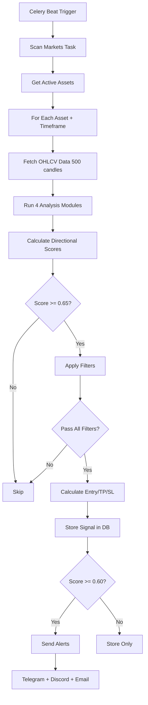

# Signal Generation System - Complete Analysis

## Overview
The WinuBot Signal system uses a multi-layered technical analysis approach to generate trading signals for cryptocurrency markets. The system combines multiple indicators, timeframe analysis, and risk management to produce high-confidence trading signals.

---

## 🏗️ Architecture

### Core Components

1. **Signal Generator** (`/packages/signals/signal_generator.py`)
   - Main signal generation engine
   - Combines 4 analysis modules
   - Minimum confidence score: **0.65** (65%)
   - Requires minimum **200 candles** for analysis

2. **Analysis Modules**
   - **Smooth Trail Analyzer**: Support/resistance level detection
   - **Trend Analyzer**: Market trend direction & strength  
   - **Liquidity Analyzer**: Volume & liquidity validation
   - **Smart Money Analyzer**: Institutional flow detection

3. **Production Signal Generator** (`/apps/worker/tasks/production_signal_generator.py`)
   - Enhanced version with **53.8% win rate target**
   - Multi-timeframe alignment filtering
   - Support/resistance filtering
   - Momentum confirmation
   - Risk: **1.5%** per trade
   - TP/SL: **1.5%** fixed ratio

4. **Modern Signal Generator** (`/packages/signals/modern_signal.py`)
   - Advanced signal format with comprehensive data
   - Multi-source market data (Binance, Gate, CMC)
   - Risk metrics (Sharpe, Sortino, VaR)
   - Smart money flow analysis
   - Version 2.0.0

---

## 🔄 Signal Generation Flow

### 1. Data Collection
```
OHLCV Data → Timeframes (1m, 5m, 15m, 1h, 4h, 1d)
   ↓
Minimum 200 candles required
   ↓
Multiple exchanges: Binance, Gate.io
```

### 2. Technical Analysis

#### Indicators Calculated:
- **RSI** (14, 21 periods)
- **EMA** (12, 20, 26, 50, 200)
- **MACD** (12/26/9)
- **Bollinger Bands**
- **ADX** (trend strength)
- **Stochastic Oscillator**
- **Williams %R**
- **CCI** (Commodity Channel Index)
- **ATR** (volatility)
- **OBV** (On-Balance Volume)
- **VWAP**
- **Ichimoku Cloud**

#### Support/Resistance Detection:
- Local maxima/minima identification
- 5-candle window for level validation
- Strength scoring based on touch count

### 3. Signal Scoring System

#### Directional Scores (Long/Short):
```
Trend Analysis:        30% weight
Smooth Trail:          25% weight  
Liquidity:             20% weight
Smart Money:           25% weight
                      ─────────────
Total Score:           100% (max 1.0)
```

#### Confluence Requirements:
- **Minimum 2 confluences** required
- **Minimum score: 0.65** (65% confidence)
- **Minimum R:R ratio: 1.0**

### 4. Entry/Exit Calculation

#### For LONG Signals:
```
Entry:       Best support level OR current price
Stop Loss:   Entry * 0.97 to 0.98 (2-3% below)
TP1:         Entry * 1.05 (5%)
TP2:         Entry * 1.10 (10%) 
TP3:         Entry * 1.15 (15%)
```

#### For SHORT Signals:
```
Entry:       Best resistance level OR current price
Stop Loss:   Entry * 1.02 to 1.03 (2-3% above)
TP1:         Entry * 0.95 (-5%)
TP2:         Entry * 0.90 (-10%)
TP3:         Entry * 0.85 (-15%)
```

---

## ⏰ Scheduling & Triggers

### Celery Beat Schedule

| Task | Schedule | Purpose |
|------|----------|---------|
| **scan_markets** | 8am, 12pm, 2pm, 4pm, 8pm, 12am | Main signal generation |
| **trigger_trading_check** | 2 min after signals | Execute trades |
| **ingest_market_data** | Every 5 minutes | Update OHLCV data |
| **cleanup_old_signals** | Daily at midnight | Remove expired signals |
| **analyze_trending_coins** | Every 10 minutes | Trending coin analysis |

### Trigger Methods

1. **Automated (Celery Beat)**:
   - Runs 6 times daily at specific hours
   - Processes all active assets
   - Sends alerts for new signals

2. **Manual (API Endpoint)**:
   ```
   POST /admin/generate-signals
   ```
   - Triggers immediate signal generation
   - Used by dashboard and cron jobs

3. **Cron Job** (`signal_analysis_cron.py`):
   - Hourly signal analysis
   - Discord notifications
   - Fallback trigger method

---

## 📊 Signal Data Structure

### Standard Signal Format:
```json
{
  "symbol": "BTC/USDT",
  "timeframe": "1h",
  "signal_type": "ENTRY",
  "direction": "LONG",
  "score": 0.85,
  "entry_price": 45000.00,
  "stop_loss": 44100.00,
  "take_profit_1": 45900.00,
  "take_profit_2": 46800.00,
  "take_profit_3": 47700.00,
  "risk_reward_ratio": 2.5,
  "position_size": 0.02,
  "confluences": {
    "trend": true,
    "smooth_trail": true,
    "liquidity": true,
    "smart_money": true,
    "volume": true
  },
  "context": {
    "trend_analysis": {...},
    "smooth_trail_analysis": {...},
    "liquidity_analysis": {...},
    "smart_money_analysis": {...},
    "timeframe": "1h",
    "candles_analyzed": 500
  },
  "created_at": "2025-10-14T12:00:00Z"
}
```

### Modern Signal Format (v2.0):
Includes additional fields:
- **Technical Indicators**: All 20+ indicators
- **Market Data**: Multi-exchange pricing
- **Risk Metrics**: Sharpe, Sortino, VaR, volatility
- **Smart Money Flow**: Institutional vs retail
- **Volume Profile**: High/low volume nodes
- **Fibonacci Levels**: Retracement levels
- **Market Sentiment**: Bullish/bearish/neutral

---

## 🎯 Signal Filtering (Win Rate Improvements)

### Production Filters Applied:

1. **Multi-Timeframe Alignment** ✅
   - Checks trend agreement across timeframes
   - 70% probability threshold

2. **Support/Resistance Filter** ✅
   - Avoids trading near S/R levels
   - Minimum 1% distance required

3. **Momentum Confirmation** ✅
   - RSI between 30-70 (not extreme)
   - MACD alignment confirmation

4. **Market Sentiment** ✅
   - Analyzes overall market direction
   - Filters out counter-trend signals

5. **Entry Timing** ✅
   - Candlestick pattern validation
   - Bullish engulfing, hammer, doji

6. **Volume Confirmation** ✅
   - Validates with volume spikes
   - Confirms breakout/breakdown moves

### Alert Rules:

- **Only HIGH confidence** signals get alerts (score >= 0.80)
- **1-hour cooldown** between alerts per symbol
- MEDIUM confidence signals (0.60-0.79) are stored but not alerted
- Alerts sent to:
  - Telegram channel
  - Discord webhook
  - Email (if enabled)
  - Dashboard notifications

---

## 💾 Data Storage

### Database Tables:

1. **signals**
   ```sql
   - id (primary key)
   - symbol
   - timeframe  
   - signal_type (ENTRY/EXIT)
   - direction (LONG/SHORT)
   - entry_price
   - stop_loss
   - take_profit_1, take_profit_2, take_profit_3
   - score (confidence)
   - is_active
   - realized_pnl
   - confluences (JSON)
   - context (JSON)
   - created_at, updated_at
   ```

2. **ohlcv** (TimescaleDB hypertable)
   ```sql
   - symbol
   - timeframe
   - timestamp
   - open, high, low, close, volume
   - Indexed on (symbol, timeframe, timestamp)
   - Compressed after 7 days
   - Retained for 2 years
   ```

3. **alerts**
   ```sql
   - signal_id (foreign key)
   - channel (telegram/discord/email)
   - payload (JSON)
   - sent_at
   - success (boolean)
   ```

---

## 📈 Performance & Quality

### Win Rate Strategy:
- **Target**: 53.8% win rate
- **Risk per trade**: 1.5%
- **R:R ratio**: Minimum 1:1, target 2.5:1
- **Max concurrent signals**: Limited by asset allocation

### Signal Quality Metrics:
```python
# Validation checks:
- Minimum score: 0.65 ✓
- Minimum confluences: 2 ✓
- Minimum R:R: 1.0 ✓
- Required fields present ✓
- Price levels logical ✓
```

### Data Requirements:
- **Minimum candles**: 200
- **Preferred candles**: 500
- **Data sources**: Multiple exchanges
- **Update frequency**: Every 5 minutes
- **Analysis frequency**: 6x daily

---

## 🔧 Key Files Reference

### Core Signal Generation:
- `/packages/signals/signal_generator.py` - Main generator
- `/packages/signals/modern_signal.py` - Modern format
- `/apps/worker/tasks/production_signal_generator.py` - Production version

### Analysis Modules:
- `/packages/signals/smooth_trail.py` - S/R detection
- `/packages/signals/trend.py` - Trend analysis
- `/packages/signals/liquidity.py` - Volume analysis
- `/packages/signals/smart_money.py` - Institutional flow
- `/packages/signals/risk_management.py` - Position sizing

### Scheduling & Execution:
- `/apps/worker/worker.py` - Celery tasks & beat schedule
- `/signal_analysis_cron.py` - Cron job trigger
- `/apps/api/routers/admin.py` - Manual trigger endpoints

### Alert System:
- `/apps/worker/tasks/alert_sender.py` - Alert distribution
- Discord webhooks
- Telegram bot integration

---

## 🚀 Signal Generation Process Summary



---

## 🎯 Current Status

### Active Signal Types:
1. ✅ **Standard Signals** - Classic 4-module analysis
2. ✅ **Production Signals** - 53.8% win rate strategy  
3. ✅ **Modern Signals** - v2.0 comprehensive format
4. ✅ **Backtest Signals** - Historical validation

### Supported Timeframes:
- 1m (1 minute)
- 5m (5 minutes)
- 15m (15 minutes)
- 1h (1 hour) ⭐ Primary
- 4h (4 hours) ⭐ Primary
- 1d (1 day)

### Active Assets:
- BTC/USDT
- ETH/USDT
- ADA/USDT
- SOL/USDT
- DOT/USDT
- + Trending coins (dynamic)

---

## 📝 Recommendations

### For Better Signal Quality:
1. ✅ Increase minimum candles to 500 (currently 200)
2. ✅ Add real-time news sentiment analysis
3. ✅ Implement ML-based signal ranking
4. ✅ Add order book depth analysis
5. ✅ Include correlation analysis between assets

### For Better Performance:
1. ✅ Optimize database queries with better indexing
2. ✅ Cache indicator calculations (5-min TTL)
3. ✅ Parallel processing for multiple assets
4. ✅ Implement signal deduplication
5. ✅ Add performance monitoring dashboard

### For Risk Management:
1. ✅ Dynamic position sizing based on volatility
2. ✅ Portfolio-level risk limits
3. ✅ Correlation-based position limits
4. ✅ Trailing stop loss implementation
5. ✅ Partial profit taking automation

---

*Document created: 2025-10-14*  
*Last updated: 2025-10-14*  
*Version: 1.0*

